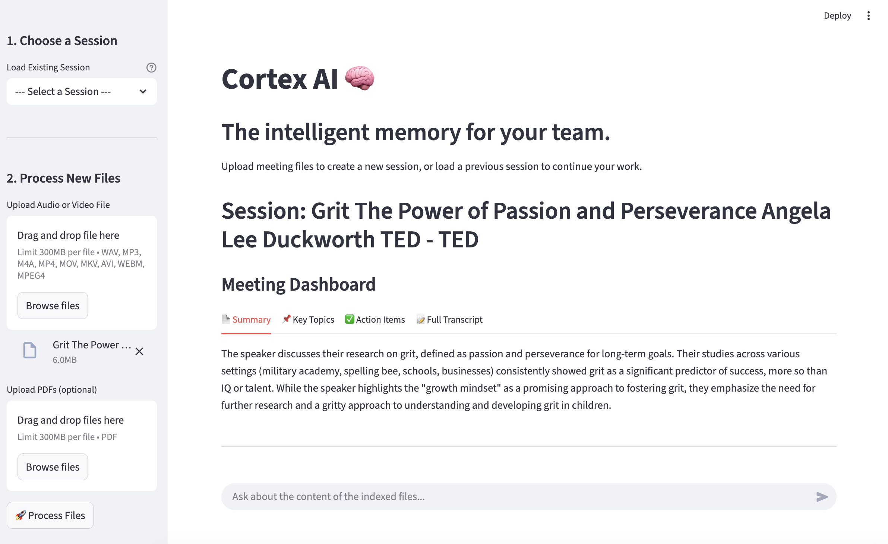

# Cortex AI

An Intelligent, Searchable Knowledge Base for Meetings.

Cortex AI is a self-contained web application that transforms audio/video meeting recordings and supplementary PDF documents into a structured, persistent, and searchable knowledge base. It is designed to help teams capture and query the collective intelligence from their discussions.



## Core Features

**Multi-Format Media Ingestion**: Accepts common audio (`.wav`, `.mp3`, `.m4a`) and video (`.mp4`, `.mov`, `.mkv`) formats for transcription.
**Document Integration**: Processes and extracts text from supplementary PDF documents, integrating them into the knowledge base.
**Automated Meeting Analysis**: For each meeting, the system generates:
    *   A concise executive summary.
    *   A list of key topics and decisions.
    *   A table of all identified action items.
**Automated Document Analysis**: Provides a high-level summary and extracts key themes from all uploaded PDF files.
**Retrieval-Augmented Generation (RAG) Chat**: An interactive chat interface allows users to ask questions in natural language. The system retrieves relevant context from both transcripts and documents to generate accurate, source-grounded answers.
**Speaker Diarization**: Automatically distinguishes between different speakers in the audio, labeling the transcript accordingly (e.g., `SPEAKER_01`, `SPEAKER_02`).
**Session Persistence**: All processed artifacts—transcripts, dashboards, and the vector knowledge base—are saved locally. Users can reload any past session instantly without reprocessing.

## Technology Stack

**Application Framework**: Streamlit
**Language Models**: Google Gemini
**Transcription**: `whisperx`
**Speaker Diarization**: `pyannote.audio`
**RAG Framework**: LangChain
**Vector Store**: ChromaDB
**Media Processing**: FFmpeg

## Installation and Setup

Follow these instructions to set up and run the project on a local machine.

### 1. Prerequisites

Ensure you have the following software installed on your system:

*   **Python** (version 3.9 or higher)
*   **FFmpeg**: A critical dependency for audio/video decoding.
    *   On macOS via Homebrew:
        ```bash
        brew install ffmpeg
        ```
    *   On Debian/Ubuntu Linux:
        ```bash
        sudo apt update && sudo apt install ffmpeg
        ```
    *   On Windows: Download the binaries from the [official FFmpeg website](https://ffmpeg.org/download.html), and add the `bin` directory to your system's PATH environment variable.

### 2. Clone the Repository

```bash
git clone https://github.com/your-username/cortex-ai.git
cd cortex-ai
```

### 3. Environment Setup

It is strongly recommended to use a Python virtual environment.

```bash
# Create the virtual environment
python3 -m venv venv

# Activate the environment
# On macOS and Linux:
source venv/bin/activate
# On Windows Command Prompt:
.\venv\Scripts\activate
```

### 4. Install Dependencies

Install the required Python packages from the `requirements.txt` file.

```bash
pip install -r requirements.txt
```

### 5. Configuration

The application requires API keys to connect to third-party services. Create a `.env` file in the root of the project directory.

```
your-project/
├── .env
└── main.py
```

Populate the `.env` file with your credentials:

```env
GOOGLE_API_KEY="your_google_api_key_here"
HUGGING_FACE_TOKEN="your_hugging_face_token_here"
```

*   `GOOGLE_API_KEY`: Obtain from [Google AI Studio](https://aistudio.google.com/app/apikey).
*   `HUGGING_FACE_TOKEN`: A read-access token is required for the `pyannote.audio` model. Obtain this from your [Hugging Face account settings](https://huggingface.co/settings/tokens).

## Usage

### Running the Application

To start the Streamlit server, execute the following command from the project's root directory:

```bash
streamlit run main.py
```

The application will launch in a new browser tab.

### Note on Large File Uploads

Streamlit's default file upload limit is 200MB. To increase this limit, you can start the application with a server flag. For example, to set a 500MB limit:

```bash
streamlit run main.py --server.maxUploadSize 500
```
This setting can also be made permanent by adding it to the `.streamlit/config.toml` file. Be aware that processing very large files is computationally intensive and may be slow on standard hardware.

## Project Structure

The codebase is organized into the following directories and files:

```
cortex-ai/
│
├── cortex_data/                # Auto-generated for persistent storage
│   ├── sessions/               # Contains session-specific metadata and dashboards (JSON)
│   └── vector_store/           # Contains the persisted ChromaDB vector databases
│
├── .streamlit/
│   └── config.toml             # (Optional) For persistent Streamlit configuration
│
├── main.py                     # Main application file: UI, state management, and orchestration
├── rag_processor.py            # Handles PDF parsing, vector store management, and RAG logic
├── transcribe.py               # Handles audio/video transcription and speaker diarization
│
├── .env                        # Stores secret API keys (not committed to version control)
├── README.md                   # This documentation file
└── requirements.txt            # Python project dependencies
```
